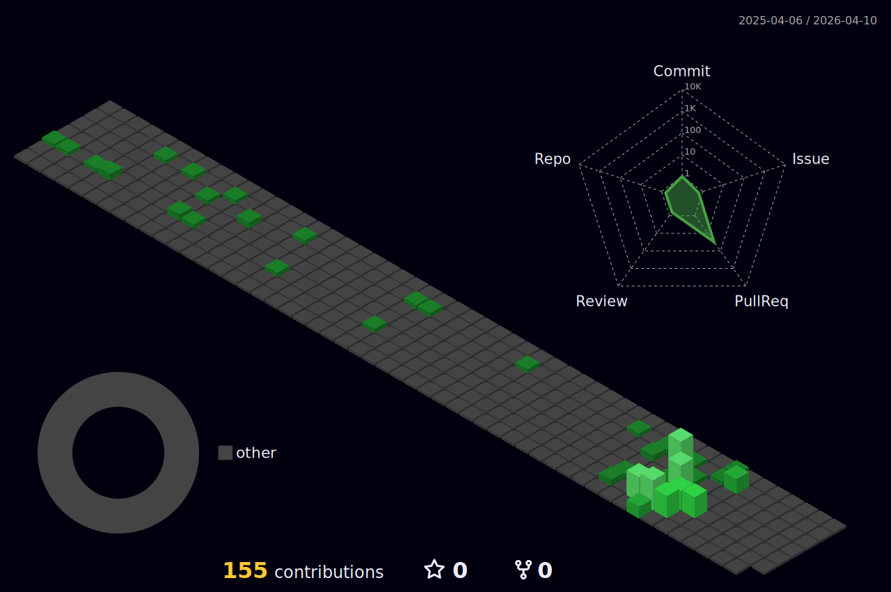

# **Hi, I'm Jinbok!** <a href="mailto:eyelash1024@naver.com" target="_blank"></a>
  
  #### After completing my degree in Architecture,
  #### I became interested in design
  ### **"and now aspire to become a Front-End Developer."**
  <!-- <span>[](https://github.com/jinbokk)</span> -->

<br/>

## **Have Some Experience With..**

  <p><b>✎ Front-end</b></p>
  <p>
     
    
    
    
    
  </p>
  <p><b>✎ Back-end</b></p>
  <p>
    
    
    
    
  </p>

<br/>

## **More About Me..**

<!-- ### A little more about me...

```javascript
const jinbok = {
  pronouns: "he" || "him",
  code: [HTML, CSS, Javascript],
  tools: [React, Redux, Node, Styled - Components, MongoDB, Axios],
};
``` -->

<!--  -->

<!--  -->


 [](https://github.com/jinbokk/github-readme-stat)
<!-- &theme=nords -->
---

### **Check out my live commercial website** :point_right: <a href="https://eeso-cake.com" target="_blank"></a>
