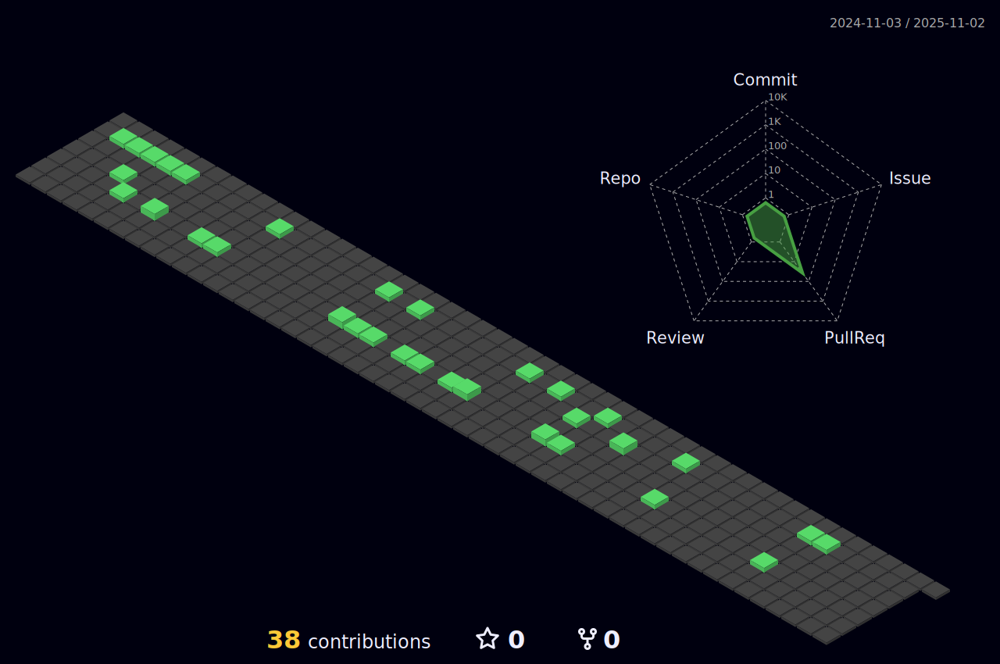

# **Hi, I'm Jinbok!** <a href="mailto:eyelash1024@naver.com" target="_blank"></a>
  
  #### After completing my degree in Architecture,
  #### I became interested in design
  ### **"and now aspire to become a Front-End Developer."**
  
  
I am currently a student studying to become a developer,
as I believe it is one of the best ways to constantly grow
by learning new technologies and tackling challenging projects. 

Developing software offers the opportunity to design and build something innovative and valuable to society, 
and I am committed to working hard to become a skilled and dedicated developer
who can create meaningful products that make a difference.
  
  

<br/>

## **Have Some Experience With..**

  <p><b>✎ Front-end</b></p>
<p>
  
  
  
  
  
  
  
  
  
  
  
  
  
</p>
  <p><b>✎ Back-end</b></p>
  <p>
  
  
  
  
  
  
  
  
  
  
  
  
  
  
</p>
<br/>

## **More About Me..**

<!-- ### A little more about me...

```javascript
const jinbok = {
  pronouns: "he" || "him",
  code: [HTML, CSS, Javascript],
  tools: [React, Redux, Node, Styled - Components, MongoDB, Axios],
};
``` -->

<!--  -->

<!--  -->


<!--  [](https://github.com/jinbokk/github-readme-stat)  -->
<!-- &theme=nords -->
---

### **Check out my live commercial website** :point_right: <a href="https://eeso-cake.com" target="_blank"></a>
